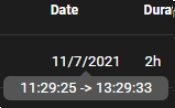

# Toggl To Jira

A web extension for syncing Toggl timelog entries to your Jira Software worklog. Also allow see basic information of issues and change their status.

Based in [@Simoneldevig jira-toggl](https://github.com/simoneldevig/jira-toggl)

## How it looks

# Download
Link to Chrome store: https://cutt.ly/3TqhTR2

Link to Firefox extension: https://cutt.ly/ITuLLTI

# How it works?

In order that toggl and jira are synchronized, **the entries in toggl must have the IDs of the JIRA tasks**, in the description of the entry, or in the project title (it is searched first in the description, and then in the project) .

1. Add the Jira issue in the description. It's useful if you are using Toggl Button or maybe just like to add the issue to the description. Usually recommended for task/issues that only take few days 

2. Set it up as a project in Toggl which also enables autocomplete in Toggl when registering time on the same task multiple times -  so win-win. Usually recomended for task that take more than a few days, and you need register time in same issue multiple times.

To use the extension you will need to login into Jira since it uses the cookies to authenticate your user. Do remember to fill out your Jira URL / email and Toggl API token.

## Get Toggl Api Key
On the toggl website, in your profile account panel https://track.toggl.com/profile go to end of page and copy the API Token key by clicking on "Click to reveal"

# Settings

# Options

* ### Merge time entries with same comment
Merge toggl logs with same description in one entry, on the specified dates.

* ### Parse Jira issue from description
Search de Issue ID of Jira first in description, and then in project name. If it's disable, only search in project.

* ### Don't include Issue ID in worklog
Avoid to include the Issue ID present in the toggl task description, in the worklog description
 

* ### Split worklog description from first occurrence of: "searched string to split"
If the toggl task description contains "the searched string to split (':' in this example)", the worklog description in Jira just inlcude the text after this string (not included)

# Other Features

* ### **Contextual Menu:** right click on Issue or Description:
    * **Start in toggl** to start a new log with the selected task in toggl.
    * **Open new tab** to open jira issue in new tab in you browser without close the extension.
    * **New State** to change the state of the issue in Jira. (defined transitions in options)

* ### **Issue Text Format**

The text format indicate the status of the issue (italic: backlog, overline: todo, bold: in progress,  strike: done).

The color is the toggl project color if the log has a project (not related to Jira).

* ### **Tooltip issue:** mouse over jira **issue** link field

Summary of a task

Type of task - Status - Priority

Times: Worked / Original estimated ( Remaining estimate  | Progress %)

Assigned

* ### **Tooltip description:** mouse over toggl **description** field

The description field corresponds to the title of the entry in Toggl, and the tooltip indicates the project of the task in Toggl (and the total hours spent on that project in Toggl)

Nothing in the Description field refers to Jira.

The color of Issue AAO-816 is given by the project color in Toggl.

* ### **Tooltip date:** mouse over **date** field

Start and finish hour of the log in Toggl.

* ### **Smart Logs**: Similar than smart commits from git for jira, but for Toggl.
If the toggl description entry contains the string "#NameTranstion",  for example #Done, after log it in jira, automatic change his status with transition defined in options with same name. For Example: Task-1 Worklog description blablabla #Done, will finish the issue.

* ### **Button To Jira Plugin**

If “Button to Jira Plugin (Usually Clockwork Free)” is enabled in the options, it opens the plugin that allows you to view worklogs in Jira on the selected dates: https://marketplace.atlassian.com/apps/1220750/clockwork-automated-timesheets-free?hosting=cloud&tab=overview

# Jira Options

* ## Get Jira issues info (Show Jira info over Issue link)
Enable fetch issue data from Jira, in order to show the Tooltips and know the status of issue. Necessary to enable the next options.

* ## Use issue jira status to set the text color/format of issue link/description
Enable this option to indicate the status of the issue by text format (bold: in progress, italic: backlog, overline: todo, strike: done), and colorize it in popup.

* ## Request confirmation for issue status change
Ask for confirmation before changing the status of the issue in Jira, using commands of context menu.

* ## Change status of issue if toggl description log contains #NameTranstion (like smartcommits, example: TASK-1 #Done)
If the toggl description entry contains the string "#NameTranstion",  for example #Done, after log it in jira, automatic change his status with transition defined in options with same name. For Example: Task-1 Worklog description blablabla #Done

* ## Jira Transitions
Well ... this part will be difficult. Because each Jira and type of projects (workflows) have different transitions.

Our Jira, with classic projects (company-managed), has de next transitions:
> Backlog:11; To Do:61; Blocked:71; In Progress: 31; In Review:51; Done: 41;

For "modern-projects" (Team-managed) has the next transitions:
> To Do:11;In Progress:21;Done:31

If you have others transitions, probably in the change it will fail or change to an unwanted state. On error, it will show a message in the snackbar with link where you can see all possible transition for the selected issue.

If you want check your possible transitions of the issues of some project (and all projects that share the same workflow), you can use the following link: https://***yourjira***.atlassian.net/rest/api/latest/issue/**ISSUE-ID**/transitions"

You should get the IDs of transitions in the response json, and the result state it will be the field [transition].to.name

* ## Button to Jira Plugin (Usually Clockwork Free)

# Toggl Track Extension

This extension works very well with original Toggl Tracker extension. This extension allow start new logs in Toggl from Jira Issues Webpage.

* Chrome: https://chrome.google.com/webstore/detail/toggl-track-productivity/oejgccbfbmkkpaidnkphaiaecficdnfn
* Firefox: https://addons.mozilla.org/en-US/firefox/addon/toggl-button-time-tracker/

For the extension works with jira, you have to enable the next option:

# Contributing To This Project

Anyone and everyone is welcome to contribute. Just create a PR with your changes and I will have a look at it.

# Building the extension
Bowered from the [vue-web-extension](https://github.com/Kocal/vue-web-extension/edit/master/README.md) that this project is based on

### `npm run build`

Build the extension into `dist` folder for **production**.

### `npm run build:dev`

Build the extension into `dist` folder for **development**.

### `npm run watch`

Watch for modifications then run `npm run build`.

### `npm run watch:dev`

Watch for modifications then run `npm run build:dev`.

It also enable [Hot Module Reloading](https://webpack.js.org/concepts/hot-module-replacement), thanks to [webpack-chrome-extension-reloader](https://github.com/rubenspgcavalcante/webpack-chrome-extension-reloader) plugin.

:warning: Keep in mind that HMR only works for your **background** entry.

### `npm run build:zip`

Build a zip file following this format `<name>-v<version>.zip`, by reading `name` and `version` from `manifest.json` file.
Zip file is located in `dist-zip` folder.

# License

Copyright &copy; 2019 Simon Eldevig, 2021 Miguel Mosquera

Licensed under the [MIT License](LICENSE)
